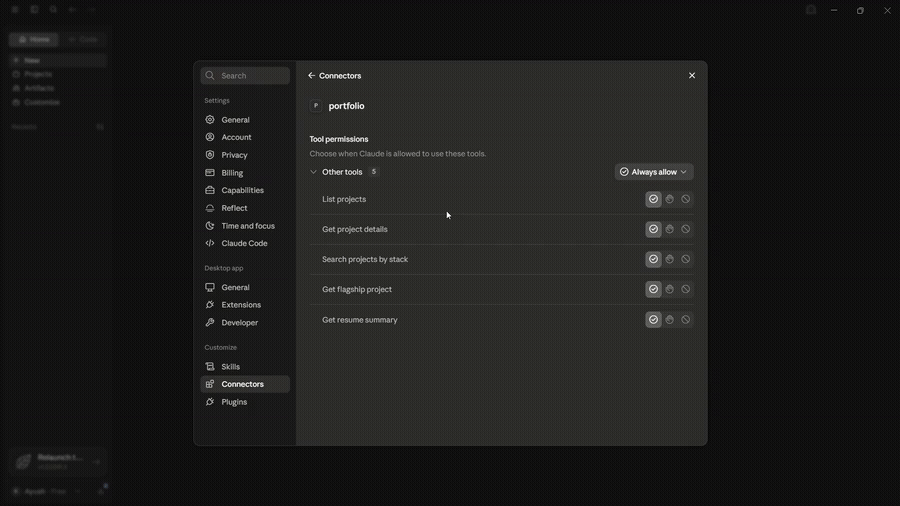
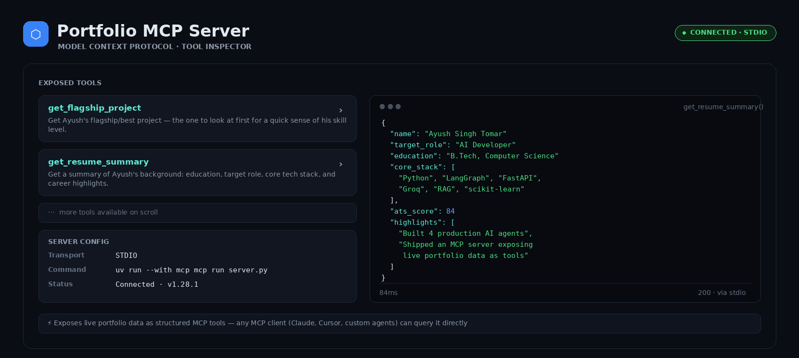
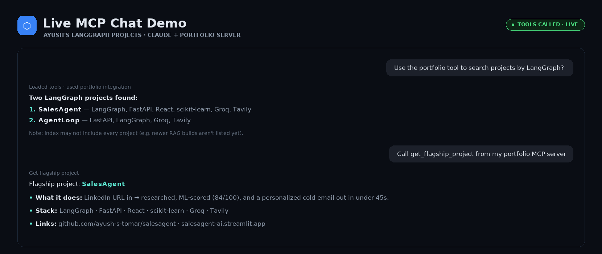

<div align="center">

# Portfolio MCP Server

**An MCP server that turns my AI project portfolio into something you can *query*, not just read.**

Point any MCP client (Claude Desktop, Cursor, custom agents) at it and ask
*"What has Ayush built with LangGraph?"* or *"What's his flagship project?"*
— it answers from live structured data, not a static PDF.

[](LICENSE)
[](https://www.python.org/downloads/)
[](https://modelcontextprotocol.io)
[](https://github.com/ayush-s-tomar/portfolio-mcp-server/actions/workflows/ci.yml)
[](https://github.com/astral-sh/ruff)
[](CONTRIBUTING.md)



[Watch the full walkthrough ▶](https://github.com/user-attachments/assets/4c1b844a-087f-48a6-b156-bdef27282acc)

</div>

---

## Table of contents

- [Why this exists](#why-this-exists)
- [Demo](#demo)
- [Tools exposed](#tools-exposed)
- [Quickstart](#quickstart)
- [Connect to Claude Desktop](#connect-to-claude-desktop)
- [Stack](#stack)
- [Testing & CI](#testing--ci)
- [Project structure](#project-structure)
- [Roadmap](#roadmap)
- [License](#license)
- [Author](#author)

## Why this exists

Most AI-developer portfolios are a list of links. This is a working MCP
server — the same protocol agentic products use to connect to tools — built
around my own portfolio. It's both a real implementation of the spec and an
answer to *"show me you've actually built with MCP,"* not just talked about it.

## Demo

| MCP Inspector — tool discovery | Live chat demo |
|---|---|
|  |  |

Full video walkthrough (setup → tool calls → live answers): **[watch here ▶](https://github.com/user-attachments/assets/4c1b844a-087f-48a6-b156-bdef27282acc)**

## Tools exposed

| Tool | Description |
|---|---|
| `list_projects` | Short summary of all 9 projects |
| `get_project_details(project_name)` | Full details for one project |
| `search_projects_by_stack(technology)` | Find projects using a given technology |
| `get_flagship_project` | The single best project to look at first |
| `get_resume_summary` | Background, target role, and core stack |

## Quickstart

```bash
git clone https://github.com/ayush-s-tomar/portfolio-mcp-server.git
cd portfolio-mcp-server

python -m venv venv
source venv/bin/activate        # Windows: venv\Scripts\activate

pip install -r requirements.txt
```

Test it interactively with the MCP Inspector before wiring it into a client:

```bash
mcp dev server.py
```

This opens a browser UI where you can call each tool manually and inspect
raw request/response payloads.

## Connect to Claude Desktop

Open your Claude Desktop config file:

| OS | Path |
|---|---|
| macOS | `~/Library/Application Support/Claude/claude_desktop_config.json` |
| Windows | `%APPDATA%\Claude\claude_desktop_config.json` |

If the file already has an `mcpServers` key with other servers in it, add
the `"portfolio"` entry inside the existing object rather than overwriting
the file. Use the **absolute path** to `server.py` on your machine:

```json
{
  "mcpServers": {
    "portfolio": {
      "command": "python",
      "args": ["/absolute/path/to/portfolio-mcp-server/server.py"]
    }
  }
}
```

Restart Claude Desktop, then ask it something like:

> "What projects has Ayush built with FastAPI?"

Claude will call `search_projects_by_stack` and answer from the live data.

## Stack

- **Python 3.10+**
- **[MCP Python SDK](https://github.com/modelcontextprotocol/python-sdk)** (`FastMCP`)
- **stdio transport**

## Testing & CI

Every push and pull request runs through GitHub Actions:

- **Lint** — `ruff check .`
- **Type check** — `mypy server.py`
- **Smoke test** — spins up the server and calls each of the 5 tools over
  stdio to confirm they return valid, schema-matching JSON

See [`.github/workflows/ci.yml`](.github/workflows/ci.yml). Run the same
checks locally before opening a PR:

```bash
pip install -r requirements-dev.txt
ruff check .
mypy server.py
pytest
```

## Project structure
portfolio-mcp-server/
├── server.py # FastMCP server + tool definitions
├── data/
│ └── projects.json # Project data the tools read from
├── tests/
│ └── test_tools.py # Smoke tests for each tool
├── requirements.txt
├── requirements-dev.txt
└── .github/workflows/ci.yml
## Roadmap

- [ ] `search_projects_by_stack` — support matching on multiple technologies at once
- [ ] Add an HTTP/SSE transport option alongside stdio for remote clients
- [ ] Publish to the MCP server registry
- [ ] Cache resume/project data with a lightweight refresh endpoint instead of static JSON

## License

Released under the [MIT License](LICENSE).

## Author

**Ayush Tomar** — [GitHub](https://github.com/ayush-s-tomar)

If this was useful as a reference for building your own MCP server, a ⭐ on the repo is appreciated.
